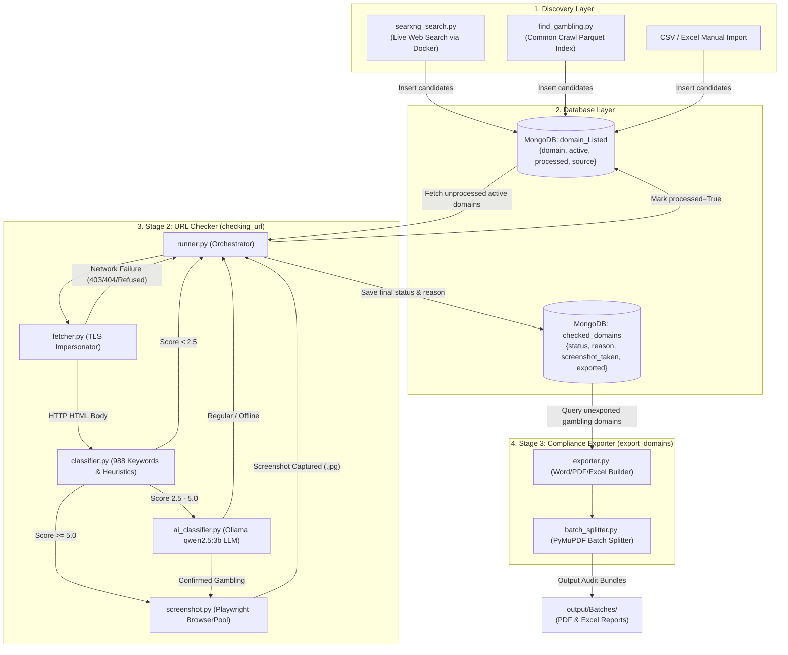
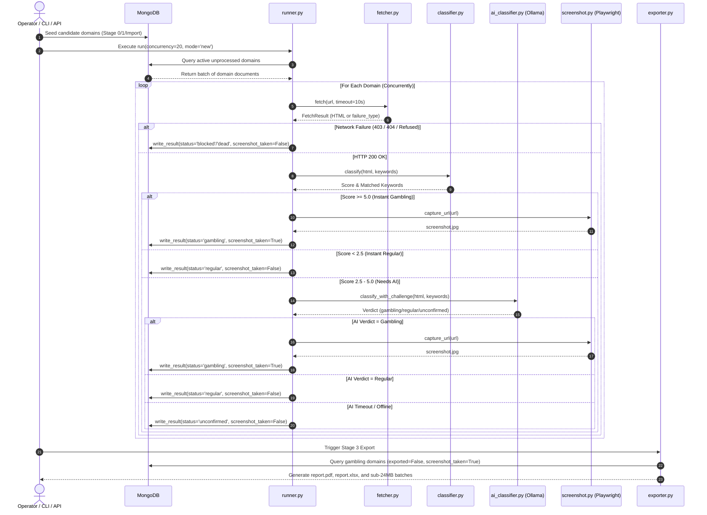
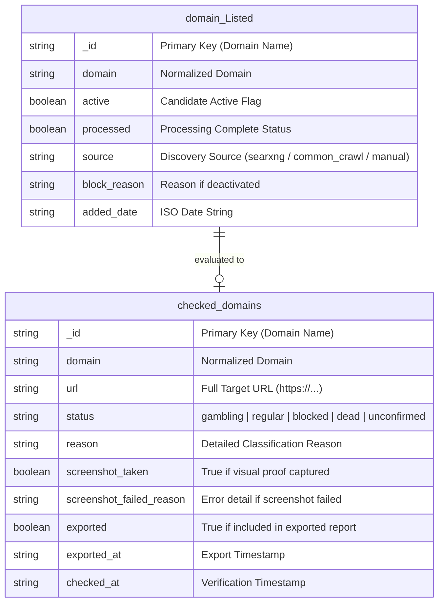

# ARCHITECTURE — gamblingwebfind System & Data Specifications

[](https://www.python.org/)
[](https://fastapi.tiangolo.com/)
[](https://www.mongodb.com/)
[](https://ollama.ai/)
[](https://playwright.dev/)
[](LICENSE)

This document provides a comprehensive technical reference for the architecture, data models, state transitions, component designs, and execution lifecycles of the **gamblingwebfind** platform.

---

## 1. PROJECT OVERVIEW

### Elevator Pitch
**gamblingwebfind** is an enterprise-grade, high-performance Python pipeline for discovering, classifying, validating, and generating audit-ready compliance reports for online gambling and illegal wagering websites. Combining high-speed TLS-impersonating fetchers, a 988-keyword heuristic engine, a two-stage local LLM challenge system (Ollama `qwen2.5:3b`), and headless browser screenshot validation, the platform detects illegal betting operators with high accuracy, zero false-positive locks, and automated generation of PDF and Excel compliance reports.

### Key Capabilities
- **Multi-Source Domain Discovery**: Mined via SearXNG meta-search queries (Stage 0) and Common Crawl parquet datasets (Stage 1).
- **TLS-Impersonating HTTP Engine**: Uses `Scrapling` with `curl_cffi` Chrome fingerprinting to bypass standard network blocks and anti-bot measures.
- **Triple-Lock Classification**:
  1. *988-Keyword Weighted Pre-Screen*: Instant fast-path categorization for high-confidence targets ($\text{Score} \ge 5.0$).
  2. *Dual-Round Local AI Challenge*: Ollama-based Analyst & Validator challenge rounds for ambiguous sites ($2.5 \le \text{Score} < 5.0$).
  3. *Immediate Proof-Required Visual Capture*: Playwright headless screenshotting to visually confirm gambling portals before generating reports.
- **Dynamic Failure Classification**: Categorizes non-responsive domains into `blocked` (WAF/Cloudflare 403), `dead` (404/DNS failure), or `unconfirmed` (network timeout/Ollama offline) to prevent infinite re-processing loops.
- **Audit-Ready Reporting & Batch Splitting**: Generates Word (`.docx`), PDF (`.pdf`), and Excel (`.xlsx`) report bundles with clickable hyperlinks, auto-split into target size bounds ($\le 24\text{ MB}$ or $1,000$ links) using `PyMuPDF`.
- **REST API & Interactive CLI**: Dual control interfaces — FastAPI REST server for programmatic pipelines and an interactive terminal menu (`main.py`).

### Target Users & Use Cases
- **Regulatory Authorities & Compliance Officers**: Monitor illegal wagering operations, unlicensed sportsbooks, and unapproved betting syndicates.
- **Cybersecurity & Brand Protection Teams**: Track domain impersonation, unauthorized affiliate networks, and brand infringement.
- **ISP & Network Infrastructure Admins**: Identify targets for DNS sinkholing, blocklists, and legal takedown requests.

---

## 2. SYSTEM ARCHITECTURE

### Architecture Style
**gamblingwebfind** is structured as a modular, event-driven multi-stage processing pipeline backed by a central MongoDB data store and asynchronous Python worker pools.

```
                  ┌──────────────────────────────────────────────┐
                  │                 USER INTERFACE               │
                  │   Interactive CLI (main.py) / FastAPI REST   │
                  └──────────────────────┬───────────────────────┘
                                         │
         ┌───────────────────────────────┴───────────────────────────────┐
         │                                                               │
         ▼                                                               ▼
┌─────────────────────────┐                                   ┌─────────────────────────┐
│ Stage 0: SearXNG Search │                                   │ Stage 1: Common Crawl   │
│ Live Web Discovery      │                                   │ Parquet Archive Mining  │
└────────────┬────────────┘                                   └────────────┬────────────┘
             │                                                             │
             └───────────────────────────┬─────────────────────────────────┘
                                         │
                                         ▼
                             ┌──────────────────────┐
                             │ MongoDB Data Store   │
                             │  • domain_Listed     │
                             │  • checked_domains   │
                             └───────────┬──────────┘
                                         │
                                         ▼
                             ┌──────────────────────┐
                             │ Stage 2: URL Checker │
                             │  • Scrapling Fetcher │
                             │  • Heuristics (988)  │
                             │  • Ollama 2-Round AI │
                             │  • Playwright Pool   │
                             └───────────┬──────────┘
                                         │
                                         ▼
                             ┌──────────────────────┐
                             │ Stage 3: Exporter    │
                             │  • Report Generator  │
                             │  • Batch Splitter    │
                             └──────────────────────┘
```

### Component Responsibilities

1. **`searxng_search.py` (Stage 0)**: Runs SearXNG via Docker to execute automated keyword search queries across Google, Bing, and DuckDuckGo, extracting candidate domains.
2. **`find_gambling.py` & `historical_common_crawl.py` (Stage 1)**: Queries AWS Common Crawl columnar parquet indexes to discover historical gambling landers.
3. **`db/mongo_client.py` (Data Persistence Layer)**: Manages MongoDB connections, domain normalization (using `.removeprefix("www.")`), state tracking (`active`, `processed`, `status`), and retry policies.
4. **`checking_url/` (Stage 2 Verification Engine)**:
   - `fetcher.py`: Asynchronously fetches target pages while impersonating browser TLS fingerprints; classifies network failures (`blocked`, `dead`, `connection_failed`).
   - `classifier.py`: Evaluates HTML against 988 keywords and regex signals, applying negative archetype gates (education, news, hospital) to suppress false positives.
   - `ai_classifier.py`: Drives local Ollama LLM (`gambling-analyst`, a custom model built from `qwen2.5:3b` via `Modelfile`) using Analyst and Validator rounds to resolve ambiguous sites. Validator is `gambling-validator`, a separate model built from `Modelfile.validator` with an adversarial "find reasons the verdict is wrong" system prompt. (Fixed 2026-08-21: `.env` previously pointed `OLLAMA_VALIDATOR_MODEL` at `gambling-analyst`, and `gambling-validator` had never been built, so the Validator round was silently re-running the Analyst model instead of an independent skeptic. Both are now built and verified — `ollama show <model> --modelfile` matches each Modelfile byte-for-byte.)
   - `runner.py`: Orchestrates parallel async task queues, progress reporting (`tqdm`), and immediate visual proof capture via `BrowserPool`.
5. **`export_domains/` (Stage 3 Reporting Engine)**:
   - `exporter.py`: Compiles verified gambling results into Word documents, screen-optimized PDFs, and Excel spreadsheets.
   - `screenshot.py`: Manages Playwright browser instances for capturing full-page screenshots.
   - `batch_splitter.py`: Splits large PDF and Excel export packages into compliant sub-24MB batches.
6. **`api/` (API Service)**: Exposes RESTful endpoints (`FastAPI`) for remote pipeline execution, domain ingestion, status monitoring, and report downloads.

### Technology Justification

| Component | Choice | Reason for Choice |
|:---|:---|:---|
| **Language** | Python 3.11+ | Unmatched ecosystem for web crawling, async I/O (`asyncio`), data analysis, and AI integrations. |
| **HTTP Engine** | `Scrapling` + `curl_cffi` | Provides browser TLS fingerprint impersonation to bypass Cloudflare and WAF protections. |
| **Local LLM** | Ollama (`gambling-analyst`, built from `qwen2.5:3b`) | Eliminates external API costs and data privacy concerns while offering high-speed local inference. |
| **Browser Engine** | Playwright (Chromium) | Reliable headless browser automation for JavaScript rendering and full-page visual capture. |
| **Database** | MongoDB | Flexible schema-less JSON storage ideal for varying HTTP metadata, headers, and classification logs. |
| **API Framework** | FastAPI + Uvicorn | Asynchronous Python REST framework with automatic OpenAPI documentation and high request throughput. |

---

## 3. ARCHITECTURE DIAGRAM

### Mermaid System Flowchart



### ASCII Fallback Diagram

```
+-----------------------------------------------------------------------------+
|                               DISCOVERY LAYER                               |
|   SearXNG Docker Search   |   Common Crawl Mining   |   CSV / API Import   |
+--------------------------------───┬─────────────────────────────────────────+
                                    │
                                    v
+-----------------------------------------------------------------------------+
|                              MONGODB DATASTORE                              |
|   domain_Listed (Source Queue)       <--->       checked_domains (Results)  |
+--------------------------------───┬─────────────────────────────────────────+
                                    │
                                    v
+-----------------------------------------------------------------------------+
|                        STAGE 2: VERIFICATION ENGINE                         |
|   [fetcher.py] ──> [classifier.py] ──> [ai_classifier.py] ──> [Playwright]  |
|   (Scrapling TLS)   (988 Keywords)     (Ollama LLM)          (Screenshots)  |
+--------------------------------───┬─────────────────────────────────────────+
                                    │
                                    v
+-----------------------------------------------------------------------------+
|                        STAGE 3: COMPLIANCE EXPORTER                         |
|   [exporter.py] (Docx/PDF/Excel)   ───>   [batch_splitter.py] (PyMuPDF)     |
+--------------------------------───┬─────────────────────────────────────────+
                                    │
                                    v
                        output/Batches/ (Audit Reports)
```

---

## 4. STEP-BY-STEP "HOW IT WORKS"

### End-to-End Processing Lifecycle



#### Step 1: Ingestion & Seeding
- **Action**: Discovery engines (`searxng_search.py`, `find_gambling.py`) or manual CSV uploaders push domain strings into MongoDB collection `domain_Listed`.
- **Handling Component**: `db/mongo_client.py` (`seed_discovered_domains` / `seed_from_csv`).
- **Domain Normalization**: Strips protocol schemes and uses `str.removeprefix("www.")` to prevent domain corruption (e.g., `win88casino.com` is preserved correctly).
- **Failure Risk**: Malformed inputs or network drops to MongoDB; mitigated by retry logic and `$setOnInsert` operations to preserve historical check state.

#### Step 2: High-Speed Async Fetching
- **Action**: `runner.py` pulls active unprocessed domains and dispatches them across an asynchronous worker pool restricted by a semaphore (`MAX_CONCURRENT_FETCHES`).
- **Handling Component**: `checking_url/fetcher.py` (`fetch`).
- **TLS Impersonation**: Uses `Scrapling` with `curl_cffi` to mimic Chrome browser TLS signatures.
- **Failure Risk**: HTTP 403 WAF blocks, HTTP 404 dead sites, or connection drops; handled by `_classify_failure` which tags `blocked`, `dead`, or `connection_failed`.

#### Step 3: Heuristic Pre-Screening
- **Action**: Received HTML is evaluated against a 988-keyword dictionary (`gambling_top_988_keywords.json`).
- **Handling Component**: `checking_url/classifier.py` (`classify`).
- **Scoring Logic**:
  - `STRONG` signals (e.g., *satta matka*, *casino live*, *betting id*) weighted at 2.0.
  - `WEAK` signals weighted at 1.0.
  - Hospitality, education, news, and e-commerce archetype filters subtract score weight to prevent false positives.
- **Decision Outcomes**:
  - $\text{Score} \ge 5.0 \implies \text{Fast-path gambling}$ (bypasses LLM).
  - $\text{Score} < 2.5 \implies \text{Instant regular}$ (bypasses LLM).
  - $2.5 \le \text{Score} < 5.0 \implies \text{Needs AI}$ (escalated to Stage 4).

#### Step 4: Local AI Challenge Round
- **Action**: Escalated sites are sent to local Ollama LLM (`gambling-analyst`, built from `qwen2.5:3b`).
- **Handling Component**: `checking_url/ai_classifier.py` (`classify_with_challenge`).
- **Two-Round Validation**:
  - *Round 1 (Analyst)*: Evaluates title, meta descriptions, and visible text.
  - *Round 2 (Validator)*: Challenges positive verdicts to verify presence of actual wagering features vs. news articles or hospitality mentions.
- **Failure Risk**: Ollama offline or high response latency; mitigated by dynamic exponential moving average (`EMA`) timeout control, falling back safely to `status="unconfirmed"` for later retry.

#### Step 5: Visual Evidence Capture
- **Action**: Domains classified as `gambling` are passed to headless Playwright browser workers.
- **Handling Component**: `export_domains/screenshot.py` (`BrowserPool.capture_url`).
- **Execution**: Full-page render, automated scrolling to trigger lazy-loaded images, network-idle waiting, and save to `output/screenshots/<domain_hash>.jpg`.
- **Validation**: `is_valid_screenshot()` verifies file existence, size ($>500\text{ bytes}$), and image header integrity.

#### Step 6: MongoDB Result Sync
- **Action**: Verification results are synced to MongoDB.
- **Handling Component**: `db/mongo_client.py` (`write_result`).
- **State Change**: Inserts complete record in `checked_domains` and sets `processed: true` in `domain_Listed`.

#### Step 7: Compliance Report Generation & Batching
- **Action**: Compiles unexported verified gambling domains into report packages.
- **Handling Component**: `export_domains/exporter.py` & `export_domains/batch_splitter.py`.
- **Outputs**:
  - `report.docx` / `report.pdf`: Visual document containing domain details, classification reasons, timestamp, and embedded screenshot.
  - `report.xlsx`: Two-sheet Excel workbook (`Captured Domains` + `Failed Domains`) with clickable hyperlinks.
  - `Batches/`: Automatically split sub-24MB PDF & Excel files for email compliance distribution.

---

## 5. FOLDER / FILE STRUCTURE

```
gamblingwebfind/
├── api/                        # FastAPI REST Server
│   ├── routers/
│   │   └── pipeline.py         # REST Endpoints for ingestion, pipeline control & exports
│   └── main.py                 # FastAPI Application Initialization
├── checking_url/               # Stage 2: URL Verification Engine
│   ├── __init__.py
│   ├── ai_classifier.py        # Ollama LLM Dual-Round Challenge Classifier
│   ├── classifier.py           # 988-Keyword Heuristic Pre-Classifier & Archetype Filters
│   ├── fetcher.py              # TLS-Impersonating HTTP Engine & Failure Classifier
│   └── runner.py               # Async Pipeline Conductor & Worker Pool Manager
├── db/                         # Data Access Layer
│   ├── __init__.py
│   └── mongo_client.py         # MongoDB Client, Schema Normalization & Atomic Updates
├── export_domains/             # Stage 3: Compliance Exporter & Reporting Engine
│   ├── __init__.py
│   ├── batch_splitter.py       # PyMuPDF Size-Bounded PDF/Excel Batch Splitter
│   ├── exporter.py             # Word, PDF & Excel Report Generator
│   └── screenshot.py           # Playwright Async BrowserPool Screenshot Manager
├── logs/                       # Test & Runtime Logs
│   └── test_run.log            # Automated Pytest Run Audit Log
├── output/                     # Generated Artifacts & Screenshots (Ignored by Git)
│   ├── Batches/                # Split PDF/Excel Compliance Bundles
│   └── screenshots/            # Verified Gambling Site Screenshots (.jpg)
├── project_sup/                # Supporting Scripts & Helpers
│   └── searxng_search.py       # Stage 0: SearXNG Search Query Generator & Crawler
├── tests/                      # Automated Pytest Suite (100% Pass Rate)
│   ├── conftest.py             # Pytest Fixtures, Mocking & Automated Teardown
│   ├── test_api.py             # FastAPI Endpoint Integration Tests
│   ├── test_end_to_end.py      # End-to-End Pipeline Execution Tests
│   ├── test_helpers_and_import.py # Utility & Helper Unit Tests
│   ├── test_stage0_keywordssearch.py # SearXNG & Query Builder Tests
│   ├── test_stage1_domain_fetch.py   # Common Crawl Parquet Parser Tests
│   ├── test_stage2_checking_url.py   # Heuristic, AI & Fetcher Tests
│   └── test_stage3_export_domains.py # Exporter & Batch Splitter Tests
├── .env.example                # Configuration Environment Variable Template
├── .gitignore                  # Git Ignore Rules
├── find_gambling.py            # Stage 1: Common Crawl Discovery Script
├── gambling_top_944_keywords.json # Master 988-Keyword JSON Dictionary
├── main.py                     # Interactive CLI Terminal Menu
├── Modelfile                   # Ollama Analyst Model System Prompt & Parameters
├── Modelfile.validator         # Ollama Validator Model System Prompt & Parameters
├── pytest.ini                  # Pytest Configuration
├── README.md                   # Project Documentation
└── requirements.txt            # Python Package Dependencies
```

---

## 6. SETUP & INSTALLATION

### Prerequisites
- **Operating System**: Windows 10/11, macOS, or Linux (Ubuntu 20.04+).
- **Python**: Version `3.11` or `3.12`.
- **MongoDB**: Version `6.0` or `8.0` running locally on port `27017` (or remote MongoDB Atlas instance).
- **Ollama**: Local AI runner (Required for Stage 2 AI evaluation). Download from [ollama.ai](https://ollama.ai/).
- **Docker Desktop**: Required only for Stage 0 SearXNG search execution.

---

### Step-by-Step Installation

#### 1. Clone the Repository
```bash
git clone https://github.com/nhiteshbohra/gamblingwebfind.git
cd gamblingwebfind
```

#### 2. Create and Activate a Virtual Environment
```bash
# Windows (PowerShell)
python -m venv venv
.\venv\Scripts\Activate.ps1

# Linux / macOS
python3 -m venv venv
source venv/bin/activate
```

#### 3. Install Python Dependencies
```bash
pip install --upgrade pip
pip install -r requirements.txt
```

#### 4. Install Playwright Browsers
```bash
playwright install chromium
```

#### 5. Configure Environment Variables
Copy `.env.example` to `.env`:
```bash
# Windows
copy .env.example .env

# Linux / macOS
cp .env.example .env
```

Review `.env` settings:
```env
MONGO_URI=mongodb://localhost:27017/
MONGO_DB_NAME=gamblingsites
MAX_CONCURRENT_FETCHES=20
FETCH_TIMEOUT=10
OLLAMA_BASE_URL=http://127.0.0.1:11434
OLLAMA_MODEL=gambling-analyst
OLLAMA_VALIDATOR_MODEL=gambling-analyst
```

#### 6. Initialize Ollama Models
Ensure Ollama is running, then pull and create custom model instances:
```bash
ollama pull qwen2.5:3b
ollama create gambling-analyst -f Modelfile
ollama create gambling-validator -f Modelfile.validator
```
Confirm both are built with `ollama list`, and that `OLLAMA_MODEL=gambling-analyst` / `OLLAMA_VALIDATOR_MODEL=gambling-validator` in your `.env` — these must point at two distinct models, not the same one twice, or the Validator round degenerates into the Analyst re-confirming itself.

---

### Running the Application

#### Option A: Interactive CLI Menu
Launch the CLI interface to run any pipeline stage interactively:
```bash
python main.py
```

#### Option B: REST API Server
Start the FastAPI server:
```bash
uvicorn api.main:app --host 0.0.0.0 --port 8000 --reload
```
Access interactive API documentation at: [http://localhost:8000/docs](http://localhost:8000/docs)

---

### Running Automated Tests
Run the complete Pytest suite (54 tests):
```bash
python -m pytest
```

---

## 7. API / MODULE REFERENCE

### Key API Endpoints (`FastAPI`)

#### 1. Pipeline Execution
`POST /api/v1/pipeline/run`
- **Request Body**:
  ```json
  {
    "stage": 2,
    "concurrency": 20,
    "limit": 100,
    "mode": "new"
  }
  ```
- **Response**:
  ```json
  {
    "status": "success",
    "message": "Stage 2 execution completed.",
    "stats": {
      "gambling": 14,
      "regular": 78,
      "blocked": 3,
      "dead": 5,
      "screenshots_taken": 14
    }
  }
  ```

#### 2. Domain Seeding
`POST /api/v1/pipeline/seed`
- **Request Body**:
  ```json
  {
    "domains": ["win88casino.com", "bet365.com", "example-news.com"],
    "source": "manual_api"
  }
  ```

#### 3. Trigger Export
`POST /api/v1/pipeline/export`
- **Response**:
  ```json
  {
    "status": "success",
    "exported_count": 14,
    "batches_created": 1,
    "output_dir": "output/Batches/20260819_040000"
  }
  ```

---

## 8. DATA MODEL

### Entity Relationship Diagram (`MongoDB`)



---

## 9. LICENSE & CONTRIBUTING

### Contributing
Contributions are welcome! Please run `python -m pytest` to ensure all tests pass cleanly before submitting a pull request.

### License
Distributed under the MIT License. See `LICENSE` for details.
