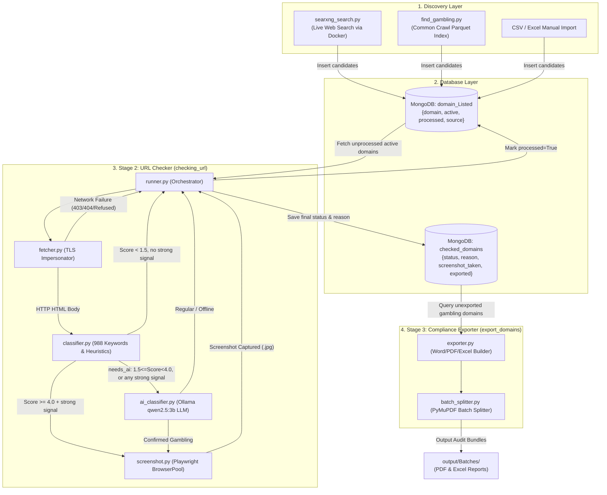
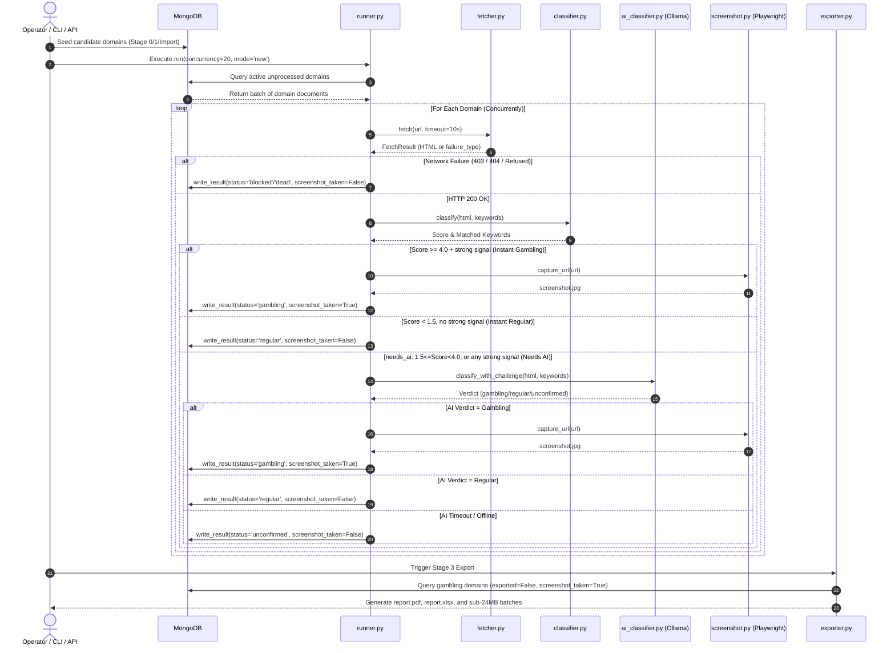
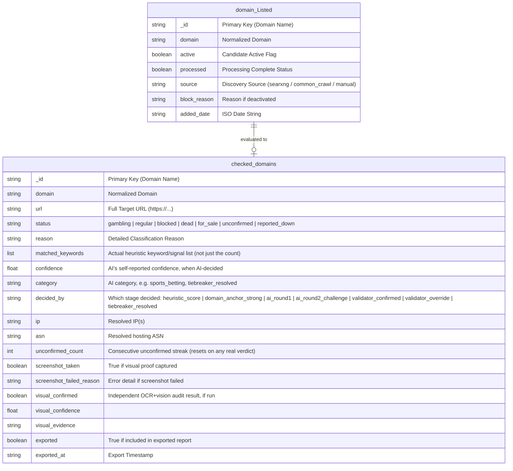

# gamblingwebfind — Automated Online Gambling Discovery & Compliance Reporting Pipeline

[](https://www.python.org/)
[](https://fastapi.tiangolo.com/)
[](https://www.mongodb.com/)
[](https://ollama.ai/)
[](https://playwright.dev/)
[](LICENSE)

An enterprise-grade, high-performance Python pipeline for discovering, classifying, validating, and generating audit-ready compliance reports for online gambling and illegal wagering websites.

---

## 1. PROJECT OVERVIEW

### Elevator Pitch
**gamblingwebfind** is an end-to-end automated intelligence platform designed to discover online gambling and wagering portals across both live web search indices and historical web archives. By combining high-speed TLS-impersonating fetchers, a 1,000+ term keyword heuristic engine, a dual-model + tiebreaker local LLM challenge system (Ollama, built from `qwen2.5:3b`/`qwen2.5:7b-instruct`), non-English page translation, headless browser screenshot validation, and an independent OCR + vision-model visual audit layer, the platform detects illegal betting operators with high recall, bounded false-positive risk, and automated generation of PDF/Excel compliance reports plus a live web dashboard.

### Key Capabilities
- **Multi-Source Domain Discovery**: Mined via SearXNG meta-search queries (Stage 0), Common Crawl parquet datasets (Stage 1), and manual CSV/known-gambling-list imports.
- **TLS-Impersonating HTTP Engine**: Uses `Scrapling` with `curl_cffi` Chrome fingerprinting to bypass standard network blocks and anti-bot measures.
- **Non-English Page Translation**: Pages that fail an offline `langdetect` English check are translated via the local LLM before classification — the English-only keyword list and AI prompts would otherwise be blind to a gambling site written in Russian, Chinese, Portuguese, etc.
- **Triple-Lock Classification**:
  1. *Keyword-Weighted Pre-Screen*: Instant fast-path categorization for high-confidence targets ($\text{Score} \ge 4.0$ + strong signal), or a domain-anchor/gambling-TLD lock.
  2. *Dual-Round Local AI Challenge*: Ollama-based Analyst & Validator challenge rounds for ambiguous sites (any strong signal, at any score), with a `qwen2.5:7b-instruct` tiebreaker model arbitrating genuine Analyst/Validator disagreement, and a small vision model (`moondream`) as a last resort for canvas/WebGL-rendered pages with zero readable text.
  3. *Proof-Required Visual Capture*: Playwright headless screenshotting to visually confirm gambling portals before generating reports.
- **Independent Screenshot Visual Audit**: A second opinion on top of the text-based verdict — OCR + a vision-model read of the already-captured screenshot itself, for domains already marked `gambling`. Never overturns a verdict on its own; a mismatch is flagged into the human review queue instead.
- **Reported-Blocked Confirmation**: For domains already exported/reported for blocking, an on-demand recheck marks a `gambling` domain `reported_down` once confirmed unreachable (multiple spaced-out attempts rule out a transient blip) — the expected outcome once an ISP/regulator acts on the report. Reachable again later, it reverts straight back to `gambling`.
- **Dynamic Failure Classification**: Categorizes non-responsive domains into `blocked` (WAF/Cloudflare 403), `dead` (404/DNS failure), `for_sale` (parked/registrar lander), or `unconfirmed` (network timeout/Ollama offline) — with a bounded retry-count cap and an AI circuit breaker so a stuck domain stops cycling forever without ever being silently dropped from review.
- **Audit-Ready Reporting & Batch Splitting**: Generates Word (`.docx`), PDF (`.pdf`), and Excel (`.xlsx`) report bundles with clickable hyperlinks, auto-split into target size bounds ($\le 24\text{ MB}$ or $1,000$ links) using `PyMuPDF`.
- **Live Web Dashboard**: A FastAPI-served dashboard (`web/`) with a full-screen domain inspector — the live site embedded inline via a server-side rendering proxy (works even when a site blocks direct iframe embedding), a domain-search box, and a side panel showing every field the pipeline recorded (IP, ASN, matched keywords, AI confidence/category, reason).
- **REST API & Interactive CLI**: Dual control interfaces — FastAPI REST server (`api/`) for the dashboard and programmatic access, and an interactive terminal menu (`main.py`).

### Target Users & Use Cases
- **Regulatory Authorities & Compliance Officers**: Monitor illegal wagering operations, unlicensed sportsbooks, and unapproved betting syndicates.
- **Cybersecurity & Brand Protection Teams**: Track domain impersonation, unauthorized affiliate networks, and brand infringement.
- **ISP & Network Infrastructure Admins**: Identify targets for DNS sinkholing, blocklists, and legal takedown requests.

---

## 2. SYSTEM ARCHITECTURE

### Architecture Style
**gamblingwebfind** is structured as a modular, event-driven multi-stage processing pipeline backed by a central MongoDB data store and asynchronous Python worker pools.

```
                  ┌──────────────────────────────────────────────┐
                  │                 USER INTERFACE               │
                  │   Interactive CLI (main.py) / FastAPI REST   │
                  └──────────────────────┬───────────────────────┘
                                         │
         ┌───────────────────────────────┴───────────────────────────────┐
         │                                                               │
         ▼                                                               ▼
┌─────────────────────────┐                                   ┌─────────────────────────┐
│ Stage 0: SearXNG Search │                                   │ Stage 1: Common Crawl   │
│ Live Web Discovery      │                                   │ Parquet Archive Mining  │
└────────────┬────────────┘                                   └────────────┬────────────┘
             │                                                             │
             └───────────────────────────┬─────────────────────────────────┘
                                         │
                                         ▼
                             ┌──────────────────────┐
                             │ MongoDB Data Store   │
                             │  • domain_Listed     │
                             │  • checked_domains   │
                             └───────────┬──────────┘
                                         │
                                         ▼
                             ┌──────────────────────┐
                             │ Stage 2: URL Checker │
                             │  • Scrapling Fetcher │
                             │  • Heuristics (988)  │
                             │  • Ollama 2-Round AI │
                             │  • Playwright Pool   │
                             └───────────┬──────────┘
                                         │
                                         ▼
                             ┌──────────────────────┐
                             │ Stage 3: Exporter    │
                             │  • Report Generator  │
                             │  • Batch Splitter    │
                             └──────────────────────┘
```

### Component Responsibilities

1. **`searxng_search.py` (Stage 0)**: Runs SearXNG via Docker to execute automated keyword search queries across Google, Bing, and DuckDuckGo, extracting candidate domains.
2. **`find_gambling.py` & `historical_common_crawl.py` (Stage 1)**: Queries AWS Common Crawl columnar parquet indexes to discover historical gambling landers.
3. **`db/mongo_client.py` (Data Persistence Layer)**: Manages MongoDB connections, domain normalization (using `.removeprefix("www.")`), state tracking (`active`, `processed`, `status`), and retry policies.
4. **`checking_url/` (Stage 2 Verification Engine)**:
   - `fetcher.py`: Asynchronously fetches target pages while impersonating browser TLS fingerprints; classifies network failures (`blocked`, `dead`, `connection_failed`, `server_error`, `parked`).
   - `classifier.py`: Evaluates HTML against 1,000+ keywords/phrases and regex signals, applying negative archetype gates (education, news, hospitality, banking) to suppress false positives.
   - `ai_classifier.py`: Drives local Ollama LLMs — `gambling-analyst`/`gambling-validator` (built from `qwen2.5:3b`) for the two-round challenge, `qwen2.5:7b-instruct` as a tiebreaker on genuine disagreement, `moondream` as a vision-model last resort, plus `translate_to_english_if_needed()` for non-English pages.
   - `runner.py`: Orchestrates parallel async task queues, progress reporting (`tqdm`), immediate visual proof capture via `BrowserPool`, an AI circuit breaker (skips waiting out another Ollama timeout once recent calls are mostly failing), and per-domain `unconfirmed` retry-count tracking.
   - `known_gambling_runner.py`: Liveness-only recheck for an imported list of already-known gambling domains (no content classification, just alive/dead + screenshot).
   - `reported_blocked_checker.py`: On-demand recheck for exported domains, confirming ISP/regulator blocking (`gambling` <-> `reported_down`).
   - `screenshot_visual_audit.py` (menu option 6) / `screenshot_folder_sorter.py` (CLI-only, `python -m checking_url.screenshot_folder_sorter`): OCR + vision-model cross-check of captured screenshots — the audit annotates DB records for gambling domains; the sorter moves confirmed-gambling images out of any folder you point it at (never the permanent archive).
   - `review_queue.py`: Tiered human-review queue generator, prioritizing the verdicts most likely to be wrong (thin heuristic evidence, low AI confidence, validator/tiebreaker arbitration, or a visual-audit mismatch).
   - `ocr_extractor.py`: RapidOCR-based text extraction from screenshots, used by the classifier's screenshot fallback and the visual audit.
   - `build_eval_set.py` / `score_eval_set.py`: Stratified real-world accuracy measurement workflow (see "Measuring Real-World Accuracy" below).
5. **`export_domains/` (Stage 3 Reporting Engine)**:
   - `exporter.py`: Compiles verified gambling results into Word documents, screen-optimized PDFs, and Excel spreadsheets (copies screenshots into the export — never moves/deletes the source).
   - `screenshot.py`: Manages Playwright browser instances for capturing full-page screenshots; `find_screenshot_path()` resolves a domain to its file on disk (including a legacy `New folder` fallback location).
   - `batch_splitter.py`: Splits large PDF and Excel export packages into compliant sub-24MB batches.
6. **`api/` (API Service)**: FastAPI routers — `domains.py` (list/search/detail/screenshot/**live-embed proxy**/save/backup), `reports.py` (list & download generated reports), `stats.py` (dashboard counters), `settings.py`. Serves the static `web/` dashboard.
7. **`web/` (Dashboard Frontend)**: Vanilla HTML/CSS/JS dashboard — domain table with filters, a full-screen split-view domain inspector (live site embedded via the proxy endpoint + an info panel with every recorded field), and a quick single-URL sandbox tester.

### Data Flow
1. Domain candidates are discovered (Stage 0/1) or imported via CSV/API into MongoDB collection `domain_Listed` (`processed: false`).
2. Stage 2 worker pool fetches domains, evaluates heuristics/AI, and captures screenshot proof if categorized as `gambling`.
3. Results are saved to MongoDB collection `checked_domains`, and original source domain in `domain_Listed` is updated (`processed: true`).
4. Stage 3 builds PDF/Excel compliance packages for unexported gambling sites and marks them `exported: true`.

### Technology Justification

| Component | Choice | Reason for Choice |
|:---|:---|:---|
| **Language** | Python 3.11+ | Unmatched ecosystem for web crawling, async I/O (`asyncio`), data analysis, and AI integrations. |
| **HTTP Engine** | `Scrapling` + `curl_cffi` | Provides browser TLS fingerprint impersonation to bypass Cloudflare and WAF protections. |
| **Local LLM** | Ollama (`qwen2.5:3b` Analyst/Validator, `qwen2.5:7b-instruct` tiebreaker) | Eliminates external API costs and data privacy concerns while offering high-speed local inference; a bigger model is only spent on the small slice of genuine disagreements. |
| **Vision Model** | Ollama `moondream` | Lightweight, purpose-built image classifier for canvas/WebGL-rendered UIs with zero readable DOM/OCR text, and for the independent screenshot visual audit. |
| **OCR Engine** | `rapidocr-onnxruntime` | Reads on-screen text from a screenshot (banner alt-text-free promo graphics, terse nav-tab labels) that the raw HTML never exposes. |
| **Language Detection** | `langdetect` | Cheap offline gate before spending an LLM call translating a page — only non-English pages pay the translation cost. |
| **Browser Engine** | Playwright (Chromium) | Reliable headless browser automation for JavaScript rendering and full-page visual capture. |
| **Database** | MongoDB | Flexible schema-less JSON storage ideal for varying HTTP metadata, headers, and classification logs. |
| **API Framework** | FastAPI + Uvicorn | Asynchronous Python REST framework with automatic OpenAPI documentation and high request throughput; also serves the `web/` dashboard. |

---

## 3. ARCHITECTURE DIAGRAM

### Mermaid System Flowchart



### ASCII Fallback Diagram

```
+-----------------------------------------------------------------------------+
|                               DISCOVERY LAYER                               |
|   SearXNG Docker Search   |   Common Crawl Mining   |   CSV / API Import   |
+--------------------------------───┬─────────────────────────────────────────+
                                    │
                                    v
+-----------------------------------------------------------------------------+
|                              MONGODB DATASTORE                              |
|   domain_Listed (Source Queue)       <--->       checked_domains (Results)  |
+--------------------------------───┬─────────────────────────────────────────+
                                    │
                                    v
+-----------------------------------------------------------------------------+
|                        STAGE 2: VERIFICATION ENGINE                         |
|   [fetcher.py] ──> [classifier.py] ──> [ai_classifier.py] ──> [Playwright]  |
|   (Scrapling TLS)   (988 Keywords)     (Ollama LLM)          (Screenshots)  |
+--------------------------------───┬─────────────────────────────────────────+
                                    │
                                    v
+-----------------------------------------------------------------------------+
|                        STAGE 3: COMPLIANCE EXPORTER                         |
|   [exporter.py] (Docx/PDF/Excel)   ───>   [batch_splitter.py] (PyMuPDF)     |
+--------------------------------───┬─────────────────────────────────────────+
                                    │
                                    v
                        output/Batches/ (Audit Reports)
```

---

## 4. STEP-BY-STEP "HOW IT WORKS"

### End-to-End Processing Lifecycle



#### Step 1: Ingestion & Seeding
- **Action**: Discovery engines (`searxng_search.py`, `find_gambling.py`) or manual CSV uploaders push domain strings into MongoDB collection `domain_Listed`.
- **Handling Component**: `db/mongo_client.py` (`seed_discovered_domains` / `seed_from_csv`).
- **Domain Normalization**: Strips protocol schemes and uses `str.removeprefix("www.")` to prevent domain corruption (e.g., `win88casino.com` is preserved correctly).
- **Failure Risk**: Malformed inputs or network drops to MongoDB; mitigated by retry logic and `$setOnInsert` operations to preserve historical check state.

#### Step 2: High-Speed Async Fetching
- **Action**: `runner.py` pulls active unprocessed domains and dispatches them across an asynchronous worker pool restricted by a semaphore (`MAX_CONCURRENT_FETCHES`).
- **Handling Component**: `checking_url/fetcher.py` (`fetch`).
- **TLS Impersonation**: Uses `Scrapling` with `curl_cffi` to mimic Chrome browser TLS signatures.
- **Failure Risk**: HTTP 403 WAF blocks, HTTP 404 dead sites, or connection drops; handled by `_classify_failure` which tags `blocked`, `dead`, or `connection_failed`.

#### Step 3: Heuristic Pre-Screening
- **Action**: Received HTML is evaluated against the keyword dictionary (`gambling_top_944_keywords.json`, ~1,000 phrases plus a small set of hand-curated bare category words — see `classifier.py`'s `STRONG_GAMBLING_SIGNALS`/`WEAK_GAMBLING_SIGNALS`).
- **Handling Component**: `checking_url/classifier.py` (`classify`).
- **Scoring Logic** (corrected 2026-08-24 -- see `checking_url/classifier.py`'s own
  module docstring for the authoritative, always-current version; this section had
  drifted out of sync with the real code and previously misstated both the weights
  and the thresholds below):
  - `WEAK` signals (a 14-term set: rebate, free spins, bonus, odds, prize, win, stake,
    bet, jackpot, etc.) weighted at **0.5**. Every other matched keyword (including the
    `STRONG` set) is weighted at **1.0** -- there is no separate 2.0-weight tier.
    `STRONG` is tracked separately as a boolean flag, not an extra score weight.
  - Hospitality/education/news/e-commerce/banking/etc. "negative archetype" hits do
    **not** subtract from the numeric score. They set a boolean gate that suppresses
    an instant-gambling lock when the score alone would otherwise trigger one, and
    require ≥2 archetype-keyword hits (≥3 for banking/fintech) to activate.
- **Decision Outcomes** (actual gates in `classifier.py`, not a flat threshold band):
  - $\text{Score} \ge 4.0$ **and** a strong/hard-evidence signal is present $\implies$
    fast-path gambling (bypasses LLM).
  - Any strong signal present at all, **regardless of score** $\implies$ needs AI
    (escalated to Stage 4).
  - Hospitality/negative-archetype page, $\text{Score} < 1.5$, no hard actionable
    signal $\implies$ instant regular (bypasses LLM).
  - Everything else $\implies$ regular.

#### Step 4: Local AI Challenge Round
- **Action**: Non-English pages are translated first (`translate_to_english_if_needed`); escalated sites are then sent to local Ollama LLMs.
- **Handling Component**: `checking_url/ai_classifier.py` (`classify_with_challenge`).
- **Multi-Round Validation**:
  - *Round 1 (Analyst, `gambling-analyst`)*: Evaluates title, meta descriptions, and visible text.
  - *Round 2 (Validator, `gambling-validator`)*: Challenges positive verdicts to verify presence of actual wagering features vs. news articles or hospitality mentions.
  - *Tiebreaker (`qwen2.5:7b-instruct`)*: Arbitrates when Analyst and Validator genuinely disagree — a bigger model, only spent on this narrow slice.
- **Failure Risk**: Ollama offline or high response latency; mitigated by a dynamic exponential moving average (`EMA`) timeout window, a circuit breaker that skips waiting out another timeout once recent calls are mostly failing, and a bounded per-domain retry-count cap (`UNCONFIRMED_RETRY_CAP`) so a stuck domain drops out of the "new domains" queue without ever being silently excluded from `--mode unconfirmed` retries. Falls back safely to `status="unconfirmed"` either way — never a guessed verdict.

#### Step 5: Visual Evidence Capture
- **Action**: Domains classified as `gambling` are passed to headless Playwright browser workers.
- **Handling Component**: `export_domains/screenshot.py` (`BrowserPool.capture_url`).
- **Execution**: Full-page render, automated scrolling to trigger lazy-loaded images, network-idle waiting, and save to `output/screenshots/<domain>_<hash>.jpg` — filename is anchored to the *domain*, not wherever it redirects to, so two domains that redirect to the same mirror/affiliate page still each get their own screenshot.
- **Validation**: `is_valid_screenshot()` verifies file existence, size, and image header integrity (rejects blank/loader-spinner captures too).
- **Permanence**: `output/screenshots/` is a permanent, append-only archive — nothing in the codebase ever moves or deletes a file from it (`delete_screenshot()` only removes an invalid/failed capture attempt, never a valid one belonging to a different domain).

#### Step 5b: Independent Visual Audit (On-Demand)
- **Action**: For already-`gambling` domains, re-reads the captured screenshot itself — OCR text plus a vision-model verdict — and checks whether the image actually backs up the text-based classification.
- **Handling Component**: `checking_url/screenshot_visual_audit.py`.
- **Outcome**: Never changes `status` by itself. Writes `visual_confirmed`/`visual_confidence`/`visual_evidence` onto the record; a mismatch surfaces as Tier 1 in `review_queue.py` for a human to look at.

#### Step 6: MongoDB Result Sync
- **Action**: Verification results are synced to MongoDB.
- **Handling Component**: `db/mongo_client.py` (`write_result`).
- **State Change**: Inserts complete record in `checked_domains` and sets `processed: true` in `domain_Listed`.

#### Step 7: Compliance Report Generation & Batching
- **Action**: Compiles unexported verified gambling domains into report packages.
- **Handling Component**: `export_domains/exporter.py` & `export_domains/batch_splitter.py`.
- **Outputs**:
  - `report.docx` / `report.pdf`: Visual document containing domain details, classification reasons, timestamp, and embedded screenshot.
  - `report.xlsx`: Two-sheet Excel workbook (`Captured Domains` + `Failed Domains`) with clickable hyperlinks.
  - `Batches/`: Automatically split sub-24MB PDF & Excel files for email compliance distribution.

---

## 5. FOLDER / FILE STRUCTURE

```
gamblingwebfind/
├── api/                         # FastAPI REST Server
│   ├── routers/
│   │   ├── domains.py           # List/search/detail/screenshot/live-embed-proxy/save/backup
│   │   ├── reports.py           # List & download generated export reports
│   │   ├── settings.py          # Dashboard settings endpoint
│   │   └── stats.py             # Dashboard counter/summary endpoint
│   └── main.py                  # FastAPI app init; serves web/ as static files
├── web/                         # Dashboard Frontend (served by api/main.py)
│   ├── index.html               # Overview / Domains table / Sandbox tabs + inspector modal
│   ├── app.js                   # Dashboard logic (filters, domain inspector, proxy embed)
│   └── style.css
├── checking_url/                # Stage 2: URL Verification Engine
│   ├── __init__.py
│   ├── ai_classifier.py         # Ollama Analyst/Validator/Tiebreaker/Vision + translation
│   ├── classifier.py            # Keyword Heuristic Pre-Classifier & Archetype Filters
│   ├── fetcher.py               # TLS-Impersonating HTTP Engine & Failure Classifier
│   ├── runner.py                # Async Pipeline Conductor, Circuit Breaker & Retry Cap
│   ├── known_gambling_runner.py # Liveness-only recheck for an imported known-gambling list
│   ├── reported_blocked_checker.py # Two-strike recheck: is a reported domain blocked yet?
│   ├── screenshot_visual_audit.py  # OCR + vision-model cross-check of gambling screenshots
│   ├── screenshot_folder_sorter.py # Sorts any folder of screenshots by the same check
│   ├── review_queue.py          # Tiered human-review queue generator
│   ├── ocr_extractor.py         # RapidOCR text extraction from screenshots
│   ├── build_eval_set.py        # Stratified sample for real-world accuracy labeling
│   └── score_eval_set.py        # Scores pipeline verdicts against human labels
├── db/                          # Data Access Layer
│   ├── __init__.py
│   └── mongo_client.py          # MongoDB Client, Schema Normalization & Atomic Updates
├── export_domains/              # Stage 3: Compliance Exporter & Reporting Engine
│   ├── __init__.py
│   ├── batch_splitter.py        # PyMuPDF Size-Bounded PDF/Excel Batch Splitter
│   ├── exporter.py              # Word, PDF & Excel Report Generator (copies, never moves)
│   └── screenshot.py            # Playwright BrowserPool + find_screenshot_path() resolver
├── output/                      # Generated Artifacts & Screenshots (Ignored by Git)
│   ├── Batches/                 # Split PDF/Excel Compliance Bundles
│   └── screenshots/             # Permanent, append-only screenshot archive (.jpg)
├── project_sup/                 # Supporting / one-off maintenance scripts
│   └── screenshot_audit.py      # Cross-checks DB screenshot_taken flags against disk
├── tests/                       # Automated Pytest Suite
│   ├── test_classifier_accuracy.py       # Heuristic regression suite (real past incidents)
│   ├── test_parked_domain_status.py      # Parked/for-sale lander classification
│   ├── test_reported_blocked_checker.py  # Two-strike confirmation logic
│   └── test_screenshot_visual_audit.py   # OCR+vision combine logic
├── .env.example                 # Configuration Environment Variable Template
├── .gitignore                   # Git Ignore Rules
├── gambling_top_944_keywords.json # Base keyword phrase list (unioned with curated sets in classifier.py)
├── main.py                      # Interactive CLI Terminal Menu (also starts the web dashboard)
├── Modelfile                    # Ollama Analyst Model System Prompt & Parameters
├── Modelfile.validator          # Ollama Validator Model System Prompt & Parameters
├── pytest.ini                   # Pytest Configuration
├── README.md                    # Project Documentation
└── requirements.txt             # Python Package Dependencies
```

---

## 6. SETUP & INSTALLATION

### Prerequisites
- **Operating System**: Windows 10/11, macOS, or Linux (Ubuntu 20.04+).
- **Python**: Version `3.11` or `3.12`.
- **MongoDB**: Version `6.0` or `8.0` running locally on port `27017` (or remote MongoDB Atlas instance).
- **Ollama**: Local AI runner (Required for Stage 2 AI evaluation). Download from [ollama.ai](https://ollama.ai/).
- **Docker Desktop**: Required only for Stage 0 SearXNG search execution.

---

### Step-by-Step Installation

#### 1. Clone the Repository
```bash
git clone https://github.com/nhiteshbohra/gamblingwebfind.git
cd gamblingwebfind
```

#### 2. Create and Activate a Virtual Environment
```bash
# Windows (PowerShell)
python -m venv venv
.\venv\Scripts\Activate.ps1

# Linux / macOS
python3 -m venv venv
source venv/bin/activate
```

#### 3. Install Python Dependencies
```bash
pip install --upgrade pip
pip install -r requirements.txt
```

#### 4. Install Playwright Browsers
```bash
playwright install chromium
```

#### 5. Configure Environment Variables
Copy `.env.example` to `.env`:
```bash
# Windows
copy .env.example .env

# Linux / macOS
cp .env.example .env
```

Review `.env` settings — the ones that most affect accuracy/throughput:
```env
MONGO_URI=mongodb://localhost:27017/
MONGO_DB_NAME=gamblingsites
MAX_CONCURRENT_FETCHES=20     # website-fetch concurrency -- separate from AI_CONCURRENCY,
                              # lowering this does NOT reduce Ollama load
FETCH_TIMEOUT=10
OLLAMA_BASE_URL=http://127.0.0.1:11434
OLLAMA_MODEL=gambling-analyst
OLLAMA_VALIDATOR_MODEL=gambling-validator   # must be a DIFFERENT model from OLLAMA_MODEL
OLLAMA_TIEBREAKER_MODEL=qwen2.5:7b-instruct-q4_K_M
OLLAMA_VISION_MODEL=moondream
AI_CONCURRENCY=2              # max parallel Ollama calls -- keep low on a single local
                              # instance with no GPU; this is the actual AI-load knob
AI_TIMEOUT_MIN=15.0           # ai_classifier.py only reads MIN/MAX/BASE, never a plain
AI_TIMEOUT_MAX=90.0           # AI_TIMEOUT var -- that key is silently ignored if set
AI_TIMEOUT_BASE=25.0
UNCONFIRMED_RETRY_CAP=5       # consecutive "unconfirmed" failures before a domain stops
                              # being re-surfaced by "Check New Domains" (still retried
                              # forever via "Re-check Unconfirmed" though)
```
`.env.example` ships broader defaults for every stage (SearXNG, Common Crawl tuning,
export batching, etc.) — treat the block above as the subset worth reviewing first, not
the full set.

#### 6. Initialize Ollama Models
Ensure Ollama is running, then pull and create custom model instances:
```bash
ollama pull qwen2.5:3b
ollama create gambling-analyst -f Modelfile
ollama create gambling-validator -f Modelfile.validator

# Tiebreaker (Analyst/Validator disagreement) and vision-model last resort
ollama pull qwen2.5:7b-instruct-q4_K_M
ollama pull moondream
```
Confirm all four are built/pulled with `ollama list`, and that `OLLAMA_MODEL=gambling-analyst`
/ `OLLAMA_VALIDATOR_MODEL=gambling-validator` in your `.env` -- these must point at
two distinct models, not the same one twice, or the Validator round degenerates
into the Analyst re-confirming itself.

---

### Running the Application

#### Option A: Interactive CLI Menu
Launch the CLI interface to run any pipeline stage interactively:
```bash
python main.py
```
```
=================================================================
              GAMBLINGWEBFIND PROCESS MENU
=================================================================
1. keywordssearch        (SearXNG / Multi-Engine Search)
2. checking_url          (Fetch, AI Classify & Screenshot)
3. export_domains        (Export Reports & Divide into Batches)
4. known gambling scan   (Import list, Screenshot live, Mark dead)
5. recheck reported      (Are exported/reported domains blocked yet?)
6. visual audit          (OCR + vision-model cross-check on screenshots)
0. Exit
=================================================================
```
Also starts the web dashboard automatically at `http://127.0.0.1:8081` (configurable via
`DASHBOARD_HOST`/`DASHBOARD_PORT`, or skip it with `python main.py --no-ui`).

#### Option B: REST API Server
Start the FastAPI server:
```bash
uvicorn api.main:app --host 0.0.0.0 --port 8000 --reload
```
Access interactive API documentation at: [http://localhost:8000/docs](http://localhost:8000/docs)

---

### Running Automated Tests
Run the complete Pytest suite (32 tests — regression checks for real past incidents, not a coverage target):
```bash
python -m pytest
```
> **Note**: These are pure-function regression tests (heuristic classifier, reported-blocked confirmation logic, OCR+vision combine logic) — no MongoDB, Ollama, or Playwright required to run them.

---

### Measuring Real-World Accuracy (Eval Set)
`pytest` only proves known synthetic edge cases still behave as expected after a code
change — it is not a measured accuracy number on real domains. For that, use the eval-set
workflow, which samples real `checked_domains` records (stratified across every decision
path: heuristic lock, domain anchor, AI round 1, validator override, tiebreaker, etc.) for
a human to label against, then scores the pipeline against those labels.

```bash
# 1. Sample a fresh, stratified batch of real domains to label (excludes pre-labeled
#    blocklist imports so the measurement isn't circular). Refuses to overwrite a CSV
#    that already has labels filled in — use --force or a different --out to bypass.
python -m checking_url.build_eval_set --per-bucket 20 --out eval_set.csv

# 2. Open eval_set.csv and fill in `human_label` per row (gambling / regular / unsure),
#    visiting each domain in a disposable/sandboxed browser — many are live gambling sites.

# 3. Score the pipeline's own verdicts against your labels — real accuracy/precision/
#    recall/F1, broken down per decision-path bucket so you can see exactly which stage
#    is weakest.
python -m checking_url.score_eval_set --in eval_set.csv --by-bucket
```
Re-run this periodically (e.g. after any classifier change, or on a schedule) to catch
accuracy drift that the synthetic pytest suite can't see.

---

## 7. API / MODULE REFERENCE

### Key API Endpoints (`FastAPI`, all under `/api`)

This is the real, current endpoint surface (`api/routers/domains.py` / `reports.py` /
`stats.py` / `settings.py`) — an earlier draft of this document described a
`/api/v1/pipeline/*` REST surface that was never built; pipeline runs are driven from
`main.py`'s CLI menu, not the API.

#### Domains (`api/routers/domains.py`)
| Endpoint | Description |
|---|---|
| `GET /api/domains` | Paginated, filterable domain list (`status`, `q`, `ip`, `screenshot`, `exported`, `source`, date range). Used by the dashboard's Domains tab. |
| `GET /api/domains/{domain}` | Full raw `checked_domains` record for one domain. |
| `GET /api/domains/{domain}/screenshot` | Serves the captured screenshot file (resolved via `find_screenshot_path`). |
| `GET /api/domains/{domain}/proxy` | **Live-embed proxy**: server-side fetches the domain's real page and re-serves it from our own origin (no `X-Frame-Options`/CSP forwarded, `<base href>` injected) so the dashboard's inspector can embed it inline even when the site blocks direct iframe embedding. Only ever fetches a URL already on file for a known domain — never an arbitrary caller-supplied URL. |
| `POST /api/test-url` | Sandbox tester: live fetch + heuristic + AI challenge + optional screenshot for one ad-hoc URL, without touching the DB. |
| `POST /api/save-domain` | Upserts a manually-tested/-corrected domain into `checked_domains`. |
| `POST /api/backup` | Triggers a MongoDB JSON backup. |

#### Reports & Stats
| Endpoint | Description |
|---|---|
| `GET /api/reports` | Lists generated export report bundles. |
| `GET /api/reports/download/{path}` | Downloads a specific report file. |
| `GET /api/stats` | Dashboard summary counters (per-status counts, screenshot/export progress). |
| `GET /api/settings` | Dashboard settings. |

---

### Key Python Module Functions

#### `checking_url.classifier.classify(html: str, keywords: set, url: str, screenshot_input=None) -> tuple[str, list[str]]`
- **Outputs**: `(decision, matched_keywords)` where decision is `"gambling"`, `"regular"`, or `"needs_ai"`. `screenshot_input` (a screenshot path) feeds an OCR pass into the same keyword scan for JS-rendered pages with near-empty raw HTML.

#### `checking_url.ai_classifier.classify_with_challenge(html: str, url: str, matched_keywords: list, fast_mode: bool) -> dict`
- **Outputs**: `{"verdict": "gambling"|"regular"|"unconfirmed", "reason": "...", "confidence": 0.0-1.0, "category": "...", "challenge_override": bool}`.

#### `checking_url.ai_classifier.translate_to_english_if_needed(html: str, url: str) -> tuple[str, bool]`
- **Outputs**: `(text_for_classification, was_translated)` — original `html` unchanged for English/short/failed-detection content; a translated flat-text blob otherwise.

#### `export_domains.screenshot.find_screenshot_path(url: str, domain: str, output_dir=None) -> str | None`
- Resolves a domain to its actual screenshot file on disk, including a fallback check for the legacy `New folder` location.

#### `export_domains.batch_splitter.create_batches(pdf_path: str, excel_path: str, output_dir: str) -> list[str]`
- **Outputs**: List of created batch file paths bounded by $\le 24\text{ MB}$ or $1,000$ links per file.

---

## 8. DATA MODEL

### Entity Relationship Diagram (`MongoDB`)



### Collection Specifications

#### 1. `domain_Listed` (Source Queue Collection)
Stores raw discovered candidate domains pending evaluation.
```json
{
  "_id": "win88casino.com",
  "domain": "win88casino.com",
  "active": true,
  "processed": false,
  "source": "searxng_search",
  "added_date": "2026-08-19"
}
```

#### 2. `checked_domains` (Results & Audit Collection)
Stores final verified classification details, AI evaluation notes, and screenshot export state.
```json
{
  "_id": "win88casino.com",
  "domain": "win88casino.com",
  "url": "https://win88casino.com",
  "status": "gambling",
  "reason": "Tie-breaker (qwen2.5:7b-instruct-q4_K_M) resolved dispute: ...",
  "matched_keywords": ["casino", "online casino", "sports betting"],
  "confidence": 0.85,
  "category": "tiebreaker_resolved",
  "decided_by": "tiebreaker_resolved",
  "ip": ["104.21.20.242", "172.67.194.225"],
  "asn": "AS13335",
  "unconfirmed_count": 0,
  "screenshot_taken": true,
  "screenshot_failed_reason": null,
  "visual_confirmed": true,
  "visual_confidence": 0.0,
  "visual_evidence": "ocr_keyword: casino",
  "exported": true,
  "exported_at": "2026-08-19T04:00:00+05:30"
}
```
Not every field is present on every record — most are only written by the stage that
actually produced them (e.g. `confidence`/`category` only exist for AI-decided verdicts,
`visual_*` only after running the visual audit).

---

## 9. LICENSE & CONTRIBUTING

### Contributing
Contributions are welcome! Please follow these guidelines:
1. Fork the repository and create a feature branch (`git checkout -b feature/amazing-feature`).
2. Run the full test suite (`python -m pytest`) to ensure all 54 tests pass cleanly.
3. Commit your changes with clear, descriptive commit messages.
4. Open a Pull Request.

### License
Distributed under the MIT License. See `LICENSE` for more information.
